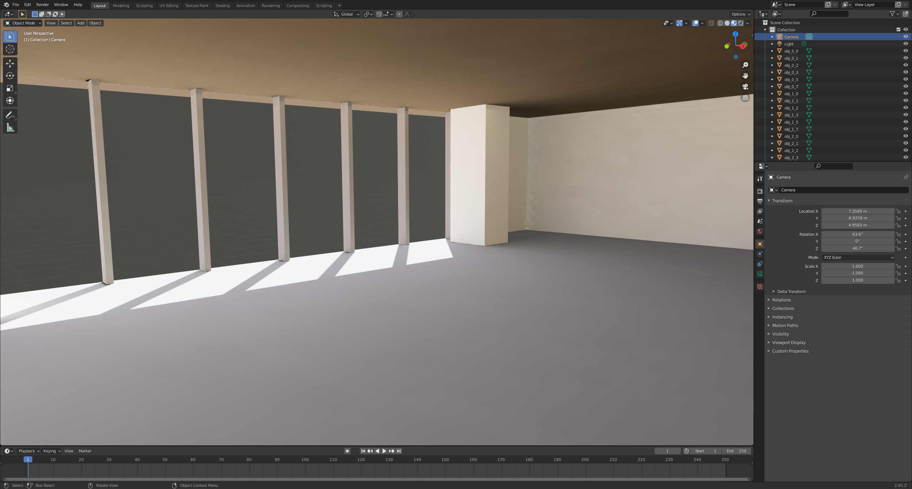

### Daylighting Scripts

* radToParallelProjections.py: This Python script takes in a Radiance RAD geometry file and outputs: 
    * Radiance parallel projection view definitions for each quad and 
    * An OBJ and MTL file to link the geometry to the parallel projection texture.

### Requirements

Python 3.x

#### Python Packages
* numpy
* honeybee-radiance

### Instructions

* To generate the Radiance parallel projections from the RAD file and generate the corresponding OBJ and MTL file, run the following: `python3 radToParallelProjections.py myRadFile.rad`
    * Check the `RIF_PICTURE_PREFIX` global variable to make sure it matches the specification in your RIF script
    * The name of the generated OBJ and MTL file can be modified via the `BASE_FILE_NAME` global
    * The scene UP direction can be modified via the `SCENE_UP` global
    * Note that the inputted RAD file should match the RAD file being used in Radiance for the rendering
* The Radiance views will be printed to the terminal. From here you can copy and paste them directly into a Radiance RIF script for rendering with rpict.
* The OBJ and MTL file can be used to import the model and HDR textures into a 3D application like Blender.
* Depending on the use case, the specular component of materials in the RAD file of the Radiance project may need to be set to 0.

### Nomenclature

* OBJ: Wavefront OBJ file
* MTL: Wavefront MTL file
* RAD: Radiance scene descrption file, usually contains geometry and material information.
* RIF: Radiance rendering script

### Images

Office scene in Blender with parallel projection textures on each quad
